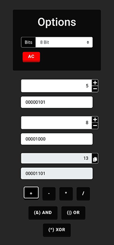
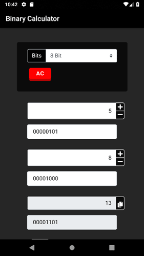
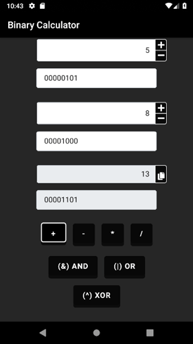
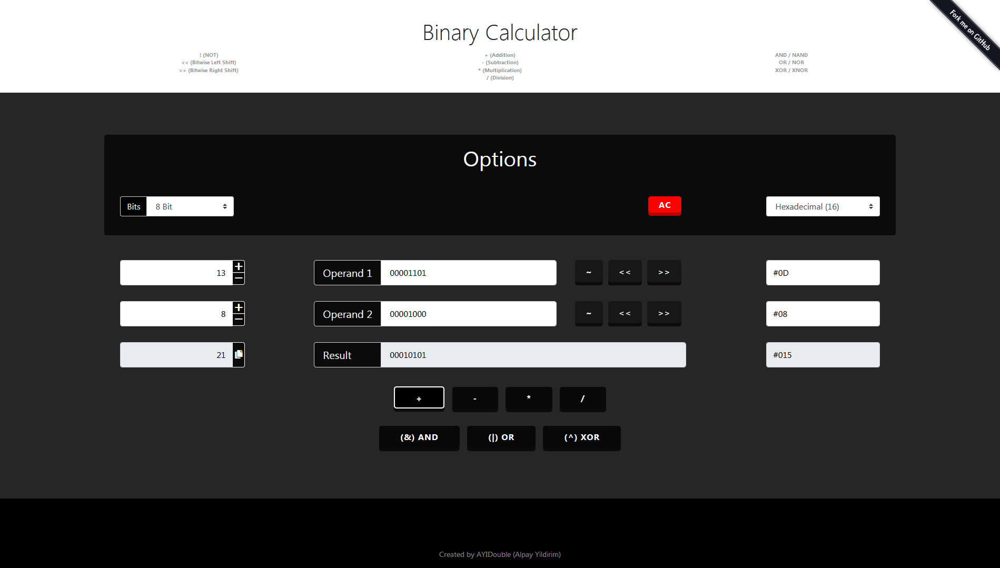
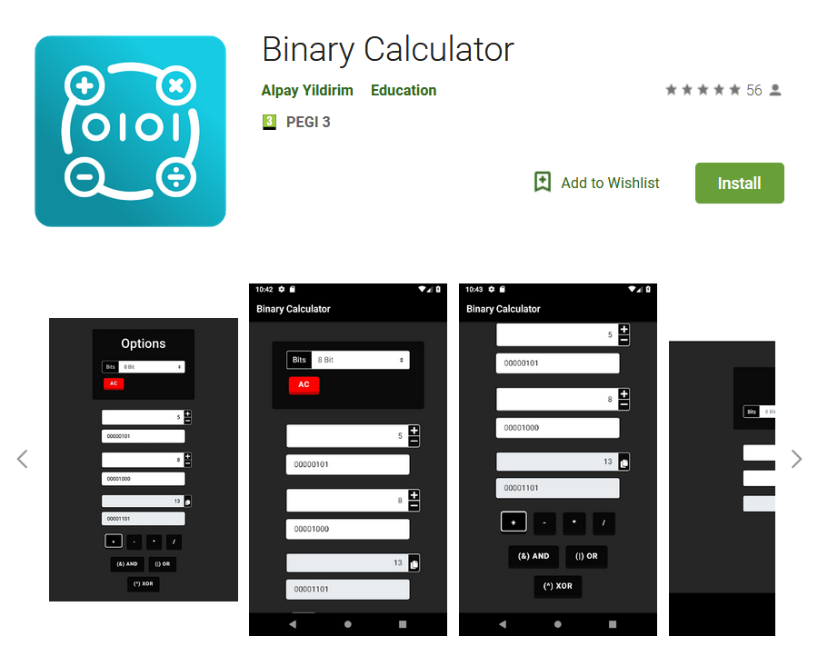

# [🔟 Binary Calculator JavaScript 🔟](https://ayidouble.github.io/Binary-Calculator-JavaScript)

**Link** : **[https://ayidouble.github.io/Binary-Calculator-JavaScript](https://ayidouble.github.io/Binary-Calculator-JavaScript)** 
**Mobile App** : **[https://github.com/AYIDouble/Binary-Calculator-Android-Java-App](https://github.com/AYIDouble/Binary-Calculator-Android-Java-App)** 
**Official Google Play Store Download Link** : **[https://play.google.com/store/apps/details?id=com.binarycalculator.ayidouble.binarycalculator.app](https://play.google.com/store/apps/details?id=com.binarycalculator.ayidouble.binarycalculator.app)**

A handy **Calculator** for binary operations, that works on **all devices**. 📱 💻 🖥

Feel free to use the **Calculator** for teaching Numeral systems as an example.
If you have Suggestions or find Errors, you're free to contact me on GitHub or submit your changes.
The Reason why I build this **Calculator** was, because there wasn't a good one on the Web.
The next Project will be a ternary **Calculator** for ternary calculations with trytes and trits,
this will be a perfect template to create such one.
## [📱 Mobile (Smartphone): 📱](https://ayidouble.github.io/Binary-Calculator-JavaScript)

## [💻 Desktop: 🖥](https://ayidouble.github.io/Binary-Calculator-JavaScript)

**[The Binary Calculator is just a Website](https://ayidouble.github.io/Binary-Calculator-JavaScript)** that each possible device can access to. 
## ***You can use the Binary Calculator on your: 📱 💻 🖥***
- ***[Smartphone](https://ayidouble.github.io/Binary-Calculator-JavaScript) (Android/iOS etc.) 📱***
- ***[Tablet](https://ayidouble.github.io/Binary-Calculator-JavaScript) (Chrome, Firefox, Edge, Safari) 📱***
- ***[Laptop](https://ayidouble.github.io/Binary-Calculator-JavaScript) (Chrome, Firefox, Edge, Safari) 💻***
- ***[Desktop](https://ayidouble.github.io/Binary-Calculator-JavaScript) (Chrome, Firefox, Edge, Safari) 🖥***

## [📱 FREE Download Google Play Store: 📱](https://play.google.com/store/apps/details?id=com.binarycalculator.ayidouble.binarycalculator.app)

## Binary Operations ➕ ➖ ➗ ✖️

- **\+ (Addition)**
- **\- (Subtraction)**
- **\* (Multiplication)**
- **\/ (Division)**

- **! (NOT)** ex. ! 10101010 = 01010101
- **<< (Bitwise Left Shift)** ex. 1010 << 0101
- **\>\> (Bitwise Right Shift)** ex. 1010 >> 0101

- **AND / NAND**
- **OR / NOR**
- **XOR / XNOR**

## As efficient as possible ⚙️

The **Calculator** is designed to give responses on every action,
this is noticeable as an example at the addition of two Bytes,
while you're typing, an algorithm already calculates every number you type and displays the result.

## The Calculator allows you to ⛓

- see how Hexadecimal Values are stored in Binary (ex. HTML Color Codes RGB(**255**, **255**, **255**) = RGB(**8-Bit**, **8-Bit**, **8-Bit**))
- how much **8, 16, 32 Bit** can store, (ex. unsigned **8-Bit** can store values from **(00000000) 0 ... 255 (11111111)**)
- see how other numeral systems are working (**ternary**, **quaternary**, **octal**, **hexadecimal**)

## The Future 💡

- [ ] Implementing a switch that allows you to change between Unsigned and Signed (negative numbers possible, ex. unsigned **16-Bit** Integer).
- [ ] Using BigNumber.js, this is needed to display **64-Bit**, **128-Bit** , **256-Bit**, ... (JavaScript has no datatypes, var is being saved as a **signed 32-Bit Integer +- 2 147 483 647**).
- [ ] More responsive elements and better support for mobile devices.
- [x] Implementing a Ternary Calculator that is working with Trits and Trytes, this is very interesting for quantum mechanics (Quantum Computing). It's a good way of a concept that could be used to use the power of Qubits that can have multiple states. [It's Done, Check it out here!](https://github.com/AYIDouble/Trinary-Calculator-JavaScript)
- [ ] More numeral systems.
